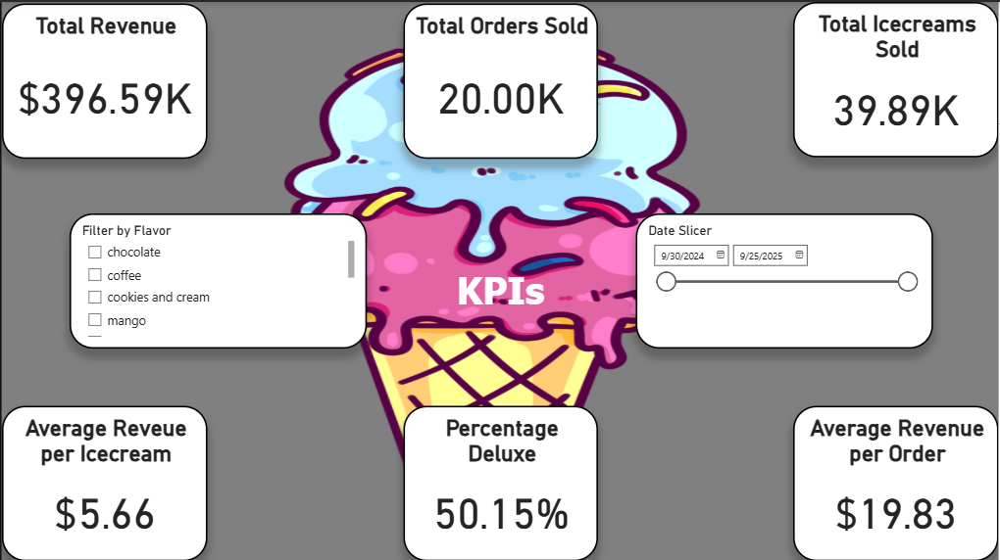
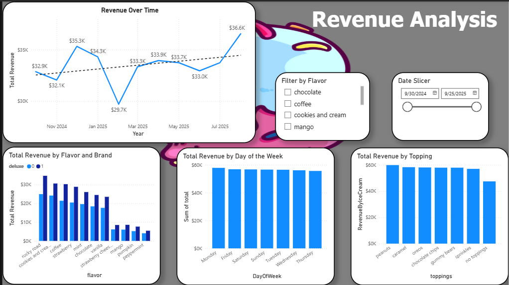
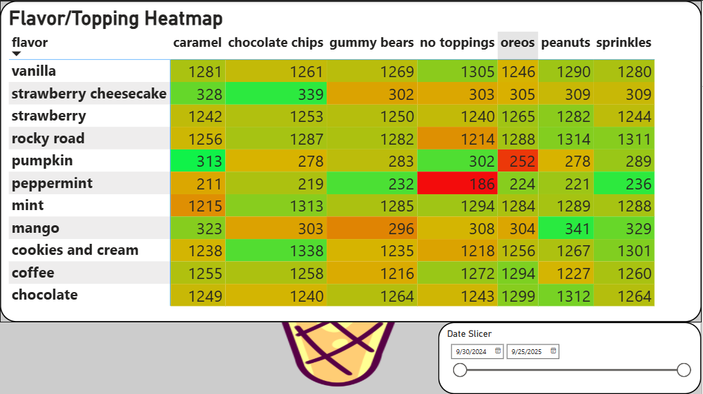
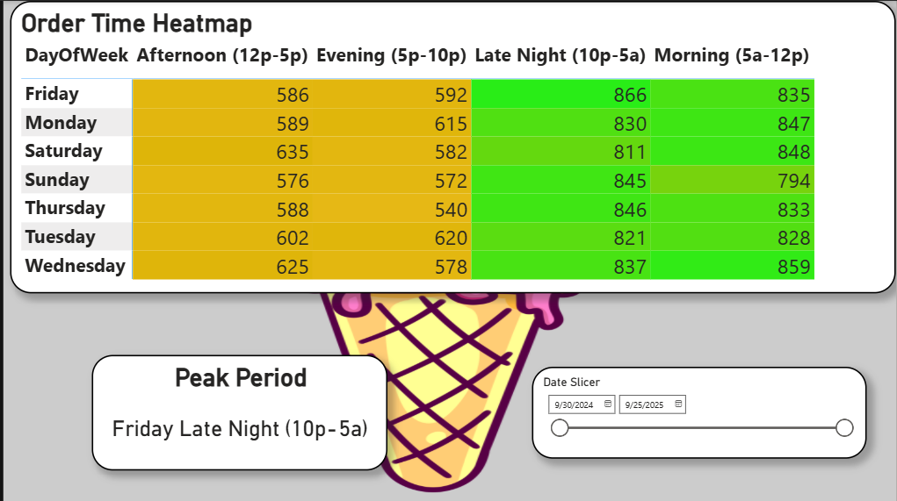

# Ice-Cream Dashboard v2

## Description
Interactive Power BI dashboard analyzing ice cream orders, flavor performance, and topping combinations. Built to demonstrate advanced data cleaning, modeling, and visualization design - transforming messy transactional data into clear business insights.  

Version 2 also expands the original ordering system with new functionality:
- Add new orders to a database  
- Generate random orders for testing  
- Clear the database as needed  

---

## Skills Demonstrated
- Power BI dashboard design  
- Data cleaning and transformation  
- DAX measures and calculated fields  
- Interactive filtering and slicer synchronization  
- Data storytelling and layout design  
- Basic database management through order generation and clearing scripts  

---

## Features
- Heatmap showing most popular flavor-topping combinations  
- KPI cards for total revenue, total orders, and average order value  
- Trend visuals to observe changes over time  
- Column charts for revenue by flavor and topping  
- Date and flavor slicers synced across all visuals  
- Updated order system with add, generate, and clear functions  
- Polished, consistent theme with intuitive navigation  

---

## How to Open
1. Download and open the `IceCreamDashboard.pbix` file in **Power BI Desktop**.  
2. Use the included scripts to generate new orders or clear the database as needed.  
3. Interact with slicers and filters to explore trends and insights.  
4. Optionally, view static screenshots in the `/Screenshots/` folder.  

---

## Example Views
**KPI Overview:**  
Displays important KPIs to give quick overall insights

**Revenue Analysis:**  
Displays revenue trends

**Flavor/Topping Heatmap:**
A heatmap that shows which flavor-topping combinations are popular. (Seasonal Flavors adjusted for limited share of orders)

**Order Time Heatmap:**  
Shows seasonality and how order volume fluctuates by time and date.  

---

## Process
This project followed a complete analytics workflow:
1. **Data Cleaning:** Fixed inconsistent text formatting, removed extra spaces, and handled multiple rows per order to prevent double counting.  
2. **Modeling:** Built a relational model linking orders, flavors, toppings, and dates for accurate aggregation.  
3. **DAX Logic:** Created key measures such as `Total Revenue`, `Total Orders`, and `Average Order Value`, ensuring accurate calculations across relationships.  
4. **Visualization:** Designed interactive visuals and synced slicers to create a seamless user experience. Experimented with multiple chart types before finalizing those that best communicate the data.  
5. **Design & Functional Updates:** Applied a consistent color palette and polished layout, while adding scripts for adding orders, generating sample orders, and clearing the database.  

---

## Project Notes
This dataset was randomly generated to focus on demonstrating Power BI capabilities and database interaction rather than producing real business conclusions. The main objective was to showcase strong data modeling, problem-solving, dashboard design, and basic database management skills.

---

## Project Evolution
This dashboard builds on my original Python-based Ice-Cream program.

- **Version 1:** A text-based Python application where users could create custom ice cream orders, select toppings, and calculate prices using loops and conditionals. No database was used; orders existed only in memory.  
- **Version 2:** This Power BI dashboard expands the project into a full analytics workflow — including data cleaning, DAX measures, interactive visualization, and database functionality for adding, generating, and clearing orders.

Together, these projects demonstrate my growth from writing procedural code to developing complete, insight-driven analytics solutions.

**Previous Project:** [Ice-Cream Order System (Python)](https://github.com/JakeBredice/portfolio-jakebredice/tree/main/Python/Icecream-Ordering-System)
